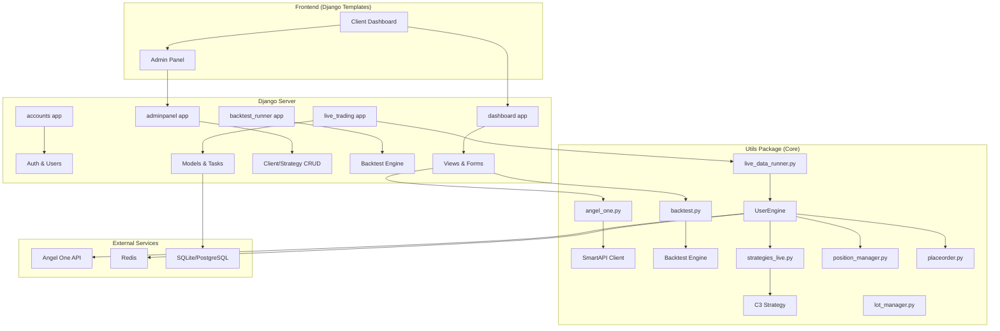
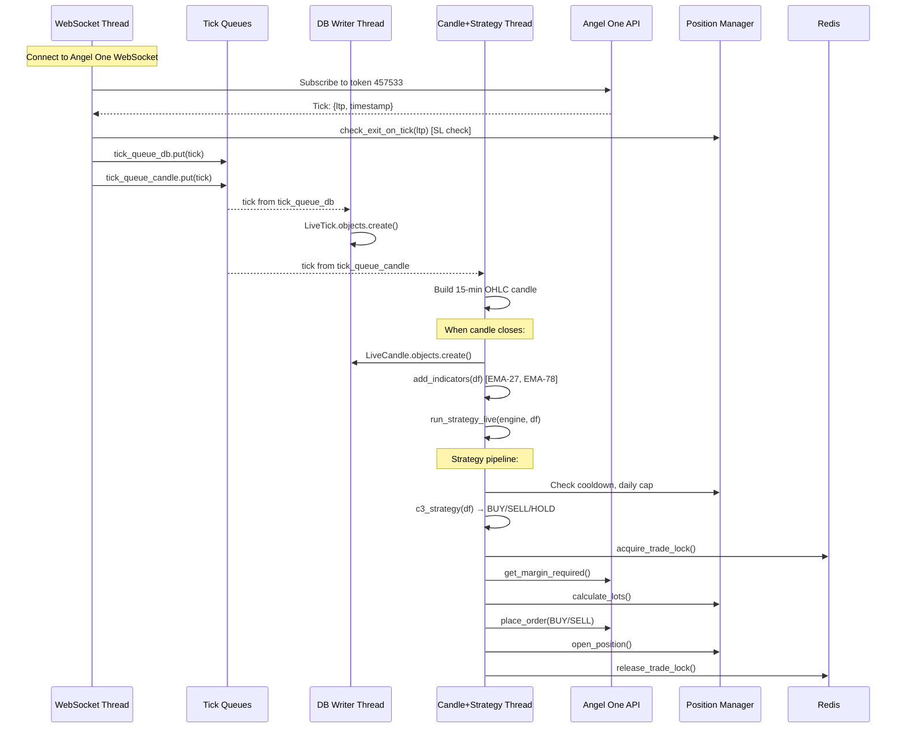
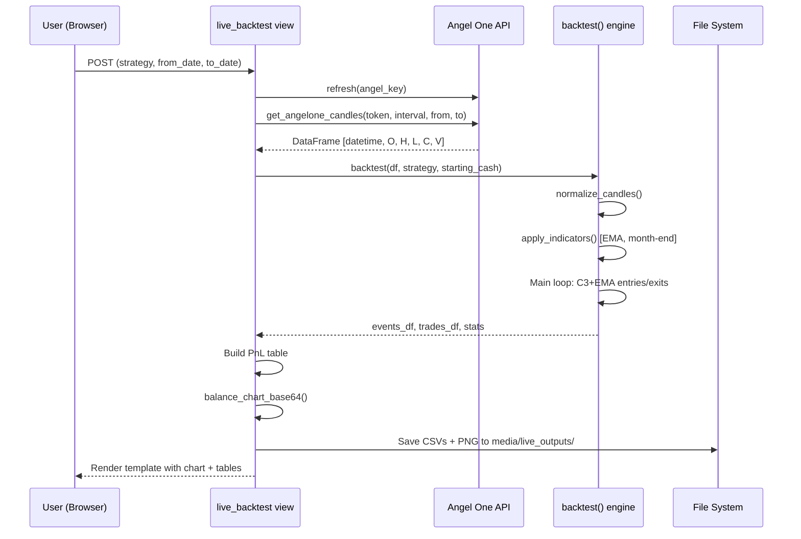

# 📊 Trading Dashboard — Full Project Documentation

> **Framework**: Django 4.2 · **Language**: Python 3.x · **Broker**: Angel One (SmartAPI)  
> **Database**: SQLite (dev) / PostgreSQL (prod) · **Task Queue**: Celery + Redis  
> **Deployment**: Render.com + Whitenoise static files + ngrok (dev tunnelling)

---

## Table of Contents

1. [Project Overview](#1-project-overview)
2. [Architecture Diagram](#2-architecture-diagram)
3. [Directory Structure](#3-directory-structure)
4. [Django Apps — Detailed Breakdown](#4-django-apps--detailed-breakdown)
   - 4.1 [`portal/` — Project Configuration](#41-portal--project-configuration)
   - 4.2 [`accounts/` — Authentication & User Management](#42-accounts--authentication--user-management)
   - 4.3 [`adminpanel/` — Admin Dashboard](#43-adminpanel--admin-dashboard)
   - 4.4 [`dashboard/` — Client Dashboard](#44-dashboard--client-dashboard)
   - 4.5 [`backtest_runner/` — Backtesting Engine](#45-backtest_runner--backtesting-engine)
   - 4.6 [`live_trading/` — Live Trading Models & Tasks](#46-live_trading--live-trading-models--tasks)
5. [Utils Package — Core Trading Logic](#5-utils-package--core-trading-logic)
6. [Trading Strategy — C3 Breakout + EMA](#6-trading-strategy--c3-breakout--ema)
7. [Live Trading Pipeline](#7-live-trading-pipeline)
8. [Backtesting Pipeline](#8-backtesting-pipeline)
9. [Database Models](#9-database-models)
10. [URL Routing Map](#10-url-routing-map)
11. [Templates](#11-templates)
12. [Configuration & Environment](#12-configuration--environment)
13. [Dependencies](#13-dependencies)
14. [How to Run](#14-how-to-run)

---

## 1. Project Overview

This is a **full-stack algorithmic trading platform** built on Django that:

- **Connects to Angel One** broker via SmartAPI for live market data and order placement
- **Runs a C3 Breakout + EMA crossover strategy** on 15-minute candles
- **Backtests strategies** against historical data fetched from Angel One
- **Trades live** by streaming WebSocket ticks, building candles in-memory, and placing real orders
- **Provides web dashboards** for both clients (traders) and admins
- **Manages risk** with fixed stop-loss, trailing stop-loss, lot sizing, cooldown periods, and daily trade caps

### Key Trading Instruments

The platform is primarily configured for **MCX Silver Mini (SILVERM)** futures but the strategy is parameterizable for any instrument.

---

## 2. Architecture Diagram



---

## 3. Directory Structure

```
trading_dashboard/
├── .env                          # Environment variables (SECRET_KEY, DB creds, REDIS_URL)
├── manage.py                     # Django CLI entry point
├── worker.py                     # Standalone live trading worker process
├── build.sh                      # Render.com build script
├── requirements.txt              # Python dependencies
├── db.sqlite3                    # SQLite database (development)
├── compare_outputs.py            # Debug: compare backtest outputs
├── output.txt                    # Debug output log
│
├── portal/                       # ← Django project settings
│   ├── __init__.py               # Celery app import
│   ├── settings.py               # All Django settings
│   ├── urls.py                   # Root URL routing
│   ├── wsgi.py                   # WSGI application entry
│   ├── asgi.py                   # ASGI application entry
│   └── celery.py                 # Celery configuration + beat schedule
│
├── accounts/                     # ← Authentication app
│   ├── models.py                 # Custom User model (extends AbstractUser)
│   ├── views.py                  # Login, signup, health check endpoints
│   ├── urls.py                   # Auth URL routes (/accounts/login, signup, logout)
│   ├── forms.py                  # LoginForm, SignUpForm
│   ├── admin.py                  # User admin registration
│   └── templates/accounts/       # Login & signup HTML templates
│       ├── login.html
│       └── signup.html
│
├── adminpanel/                   # ← Superuser admin dashboard
│   ├── views.py                  # Admin home, client CRUD, strategy CRUD, API key mgmt
│   ├── urls.py                   # Admin URL routes (/adminpanel/clients, strategies)
│   ├── forms.py                  # StrategyForm, AdminAddClientForm, AdminClientAPIForm
│   ├── decorators.py             # @admin_required decorator
│   └── templates/adminpanel/
│       ├── base.html             # Admin layout template
│       ├── dashboard.html        # Admin home with stats cards
│       ├── clients.html          # Client management table
│       ├── client_detail.html    # Client detail view
│       └── manage_strategies.html# Strategy CRUD interface
│
├── dashboard/                    # ← Client-facing dashboard
│   ├── models.py                 # BacktestResult model
│   ├── views.py                  # Home, PnL report, live backtest, start/stop trading
│   ├── urls.py                   # Dashboard routes (/, pnl_report, live-backtest, etc.)
│   ├── forms.py                  # RunRequestForm, AngelOneKeyForm, LiveBacktestForm
│   ├── context_processors.py     # Injects trading_enabled status into all templates
│   └── templates/dashboard/
│       ├── base.html             # Client layout template
│       ├── dashboard_home.html   # Home with balance cards + chart
│       ├── api_integration.html  # AngelOne API key configuration
│       ├── live_backtest.html    # Run backtest with live data
│       ├── pnl_report.html       # Real-time P&L from broker
│       ├── reports.html          # Backtest run history
│       ├── result.html           # Backtest result display
│       └── home.html             # Alternative home template
│
├── backtest_runner/              # ← Backtesting models & engine
│   ├── models.py                 # Strategy, AngelOneKey, RunRequest models
│   ├── backtest_engine.py        # Simplified backtest engine
│   ├── runner.py                 # Legacy runner (commented out)
│   ├── admin.py                  # Django admin registrations
│   └── Bro_gaurd_SILVERMINI.py   # Reference strategy script (original logic)
│
├── live_trading/                 # ← Live trading app
│   ├── models.py                 # LiveTick, LiveCandle, LivePosition, TradeStats
│   ├── engine.py                 # LiveEngine class (tick → candle → strategy)
│   ├── trader.py                 # Trader class (order execution wrapper)
│   ├── tasks.py                  # Celery tasks for processing live data
│   ├── websocket.py              # SmartAPI WebSocket wrapper
│   ├── views.py                  # start_single_live endpoint
│   └── apps.py                   # App config (auto-start engines on boot)
│
├── utils/                        # ← Core trading logic package
│   ├── angel_one.py              # Angel One API client (login, candles, balances, orders)
│   ├── backtest.py               # Full-featured backtesting engine
│   ├── strategies_live.py        # C3 breakout strategy implementation
│   ├── position_manager.py       # Position lifecycle (open, SL check, exit, cooldown)
│   ├── lot_manager.py            # Dynamic lot sizing with DB persistence
│   ├── live_data_runner.py       # Multi-threaded live trading engine (UserEngine)
│   ├── indicator_preprocessor.py # EMA & month-end indicator calculation
│   ├── placeorder.py             # REST order placement (BUY/SELL)
│   ├── redis_cache.py            # Redis client: locks, caching
│   ├── engine_manager.py         # Start/stop UserEngine instances
│   ├── trading_manager.py        # LiveTradingManager (batch start for all users)
│   ├── expiry_utils.py           # Contract expiry date utilities
│   └── pnl_utils.py              # PnL fetching (placeholder for AngelOne TradeBook)
│
├── media/                        # ← User-uploaded & generated files
│   ├── uploads/                  # CSV uploads
│   ├── outputs/                  # Backtest output CSVs and charts
│   └── live_outputs/             # Live backtest results per user
│
└── logs/                         # ← Runtime logs (date-organized)
```

---

## 4. Django Apps — Detailed Breakdown

---

### 4.1 `portal/` — Project Configuration

The root Django project settings module.

| File | Purpose |
|------|---------|
| `settings.py` | All Django configuration: installed apps, middleware, database, Redis/Celery, static files, auth model, CSRF/allowed hosts |
| `urls.py` | Root URL router → delegates to `accounts`, `adminpanel`, `dashboard` |
| `celery.py` | Celery app setup + beat schedule (runs `process_live_data` every 1 second) |
| `wsgi.py` | WSGI entry point for production (Gunicorn) |
| `asgi.py` | ASGI entry point (unused, placeholder for WebSocket upgrade) |
| `__init__.py` | Imports Celery app to ensure it's loaded at startup |

**Key settings:**
- `AUTH_USER_MODEL = "accounts.User"` — Custom user model
- `REDIS_URL` → Used for Celery broker, result backend, and Django cache
- `STATICFILES_STORAGE = WhiteNoiseCompressedManifestStaticFilesStorage`
- Database: SQLite locally, PostgreSQL via `DATABASE_URL` in production
- CSRF trusted origins include `*.ngrok-free.dev` for development tunnelling

---

### 4.2 `accounts/` — Authentication & User Management

Handles user registration, login, and session management.

| File | Purpose |
|------|---------|
| `models.py` | **`User`** — Extends `AbstractUser` with `trading_enabled` boolean and `is_client` property |
| `views.py` | **`user_signup`** — creates new user. **`user_login`** — authenticates via username or email, redirects admins to admin panel and clients to dashboard. **`health_check`** — returns `{"status": "ok"}` |
| `urls.py` | `/accounts/login/`, `/accounts/signup/`, `/accounts/logout/`, `/accounts/health/` |
| `forms.py` | **`LoginForm`** — email/username + password. **`SignUpForm`** — username, email, password, confirm |
| `admin.py` | Registers User model in Django admin |

**Auth flow:**
1. User visits `/accounts/login/`
2. Can log in with either username or email
3. Superusers → redirected to `/adminpanel/`
4. Regular users → redirected to `/` (dashboard home)
5. Logout → redirected back to login page

---

### 4.3 `adminpanel/` — Admin Dashboard

Superuser-only interface for managing clients and trading strategies.

| File | Purpose |
|------|---------|
| `views.py` | **`admin_home`** — shows total clients + strategies count. **`manage_clients`** — lists all non-superusers. **`add_client`** / **`edit_client`** / **`delete_client`** — full CRUD. **`add_client_api`** — attach AngelOne API credentials to a client. **`manage_strategies`** / **`add_strategy`** / **`edit_strategy`** / **`delete_strategy`** — strategy CRUD |
| `urls.py` | `/adminpanel/`, `/adminpanel/clients/`, `/adminpanel/strategies/`, etc. |
| `forms.py` | **`StrategyForm`** — model form for Strategy (all fields). **`AdminAddClientForm`** / **`AdminEditClientForm`** — user management. **`AdminClientAPIForm`** — AngelOne key management |
| `decorators.py` | **`admin_required`** — decorator that redirects non-superusers to dashboard |

**Strategy fields managed:**
- `name`, `exchange`, `symbol`, `point_value`
- `ema_short`, `ema_long` (EMA periods)
- `fixed_sl_pct`, `trail_sl_pct` (stop-loss percentages)
- `breakout_buffer`, `margin_factor`

---

### 4.4 `dashboard/` — Client Dashboard

Main user-facing interface with portfolio overview, backtesting, and trading controls.

| File | Purpose |
|------|---------|
| `models.py` | **`BacktestResult`** — stores backtest run results (user, strategy, file paths, status) |
| `views.py` | **6 views** detailed below |
| `urls.py` | `/`, `/pnl_report/`, `/reports/`, `/api-integration/`, `/live-backtest/`, `/start-trading/`, `/stop-trading/` |
| `forms.py` | **`RunRequestForm`**, **`AngelOneKeyForm`**, **`LiveBacktestForm`** |
| `context_processors.py` | **`trading_status`** — injects `trading_enabled` flag into every template context |

#### Views detail:

| View | URL | Method | Description |
|------|-----|--------|-------------|
| `dashboard_home` | `/` | GET | Shows summary cards (total balance, available cash, net profit, loss/profit), graph data for daily/monthly/yearly. Uses RMS API if credentials exist, else falls back to last backtest result |
| `pnl_report` | `/pnl_report/` | GET | Fetches real-time P&L from AngelOne position book via `get_real_time_pnl()` |
| `reports` | `/reports/` | GET | Lists all `RunRequest` records for the logged-in user |
| `api_integration` | `/api-integration/` | GET/POST | User can save AngelOne API credentials. On POST: logs in via SmartAPI, stores JWT/refresh/feed tokens, starts the live trading engine |
| `live_backtest` | `/live-backtest/` | GET/POST | Runs backtest using live data from AngelOne historical API. User picks strategy + date range, system fetches candles, runs backtest, displays chart + events/trades/PnL tables |
| `start_trading` | `/start-trading/` | POST | Starts live trading engine for the user (AJAX endpoint) |
| `stop_trading` | `/stop-trading/` | POST | Stops live trading engine (AJAX endpoint) |

---

### 4.5 `backtest_runner/` — Backtesting Engine

Stores strategy configurations, API keys, and run history in the database.

| File | Purpose |
|------|---------|
| `models.py` | **3 models** — `Strategy`, `AngelOneKey`, `RunRequest` (see [Database Models](#9-database-models)) |
| `backtest_engine.py` | Simplified backtest function — takes candle DataFrame + strategy object, runs C3+EMA strategy, returns events/trades/stats. Used by older code paths |
| `runner.py` | Legacy runner (fully commented out) — originally managed backtest execution with file I/O |
| `admin.py` | Registers all 3 models in Django admin with list display and filters |
| `Bro_gaurd_SILVERMINI.py` | **Reference script** — the original standalone strategy for Silver Mini. All live trading modules are aligned to match this logic |

---

### 4.6 `live_trading/` — Live Trading Models & Tasks

Stores live market data and position state in the database.

| File | Purpose |
|------|---------|
| `models.py` | **4 models** — `LiveTick`, `LiveCandle`, `LivePosition`, `TradeStats` (see [Database Models](#9-database-models)) |
| `engine.py` | **`LiveEngine`** — simple class that appends ticks to a DataFrame, applies strategy when >= 30 candles. Lightweight; the main engine logic is in `utils/live_data_runner.py` |
| `trader.py` | **`Trader`** — wraps SmartAPI client, exposes `execute(signal)` for BUY/SELL |
| `tasks.py` | **`process_live_data`** — Celery task that reads ticks from Redis, builds candles, runs `c3_strategy`. Scheduled every 1 second |
| `websocket.py` | **`LiveWebSocket`** — wraps `SmartWebSocketV2` with subscription, callbacks, and error handling |
| `views.py` | **`start_single_live`** — endpoint to start live data feed for a single user |
| `apps.py` | **`LiveTradingConfig`** — Django app config. Has commented-out auto-start logic for trading engines on Django boot |

---

## 5. Utils Package — Core Trading Logic

The `utils/` package contains all the business logic, separated from Django's web layer.

### 5.1 `angel_one.py` — Angel One API Client

**470 lines** — The primary interface to Angel One's SmartAPI.

| Function | Description |
|----------|-------------|
| `angel_login()` | Login via REST API with client code + password + TOTP |
| `refresh()` | Refresh JWT using SmartAPI `generateSession()` + `generateToken()`. Never returns None |
| `refresh_jwt()` | Refresh using `renewAccessToken()` only |
| `ensure_fresh_token()` | Auto-refresh if token > 1 hour old |
| `force_refresh_token()` | Always refresh — used before WebSocket reconnect |
| `get_angelone_candles()` | Fetch historical OHLCV candles. Returns DataFrame with IST timestamps |
| `get_rms_balance()` | Fetch RMS balance (net, available cash, M2M realized/unrealized) |
| `get_position_book()` | Fetch position book via SmartAPI |
| `get_real_time_pnl()` | Sum P&L from all open positions |
| `get_account_balance()` | Fetch available cash, used margin, net balance |
| `get_open_positions()` | List all broker open positions |
| `get_total_pnl()` | Sum P&L from open positions |
| `login_and_get_tokens()` | Login with retries (4 attempts, 15s delay). Returns `api_key`, `jwt_token`, `feed_token` |
| `get_margin_required()` | Fetch margin requirement for a given trade via Angel One Margin API |
| `get_smartapi_client()` | Returns authenticated SmartAPI client |

### 5.2 `backtest.py` — Backtesting Engine

**533 lines** — Full-featured backtesting with dynamic lot sizing.

| Component | Description |
|-----------|-------------|
| `normalize_candles()` | Accepts DataFrame or list-of-lists, normalizes columns to `datetime`, `open`, `high`, `low`, `close` |
| `apply_indicators()` | Adds EMA short/long, 3-bar rolling highs/lows, month-end detection |
| `backtest()` | Main engine — loops through candles, applies C3+EMA entry/exit logic with dynamic lot sizing, cooldown, daily trade cap, month-end forced exit |
| `balance_chart_base64()` | Generates PNG balance chart as base64 string |
| `build_detailed_pnl_df()` | Builds detailed per-trade PnL table with MFE/MAE, holding time, brokerage |

**Default strategy parameters:**
| Parameter | Default | Description |
|-----------|---------|-------------|
| `point_value` | 5 | Price multiplier per lot |
| `ema_short` | 27 | Fast EMA period |
| `ema_long` | 78 | Slow EMA period |
| `fixed_sl_pct` | 0.015 (1.5%) | Fixed stop-loss percentage |
| `trail_sl_pct` | 0.025 (2.5%) | Trailing stop-loss percentage |
| `breakout_buffer` | 0.0012 (0.12%) | Buffer beyond C2 high/low for breakout confirmation |
| `cooldown_bars` | 3 | Candles to skip after exit |
| `daily_trade_cap` | 10 | Max entries per day |
| `brokerage_pct` | 0.0003 (0.03%) | Brokerage fee percentage |
| `reserve_cash` | 1000 | Minimum cash to keep unreserved |

### 5.3 `strategies_live.py` — C3 Strategy

**168 lines** — Strategy signal generator for live trading.

| Function | Description |
|----------|-------------|
| `c3_strategy(df)` | Evaluates last 3 closed candles for C3 breakout pattern + EMA trend. Returns `{"action": "BUY"/"SELL"/"HOLD", "reason": "...", "price": float}` |
| `should_run_strategy()` | Prevents re-running strategy on the same candle |
| `to_float()` | Safe numeric parser |

### 5.4 `position_manager.py` — Position Lifecycle

**303 lines** — Manages open positions, stop-losses, lot sizing, and cooldowns.

| Method | Description |
|--------|-------------|
| `has_open_position()` | Returns True if position exists |
| `in_cooldown()` / `tick_cooldown()` | Candle-based cooldown (3 bars after exit) |
| `check_daily_cap()` | Resets daily counter at midnight, returns True if cap (10) reached |
| `calculate_lots()` | Computes lots using cash/margin with 50% cash rule and boost logic |
| `update_after_trade()` | Updates consecutive win/loss counters, adjusts `position_size` (doubles on loss, halves on win), manages boost system |
| `open_position()` | Creates new position with fixed + trailing SL |
| `check_exit_on_tick()` | Tick-by-tick SL check: fixed SL, trailing SL, and trail update |
| `check_ema_reversal_exit()` | Exit on EMA crossover only if confirmed by opposite C3 breakout |
| `force_exit()` | Exit for month-end, EOD, etc. |

### 5.5 `lot_manager.py` — Dynamic Lot Sizing (DB-Persisted)

**120 lines** — Same logic as `position_manager.py`'s lot sizing but persists state in `TradeStats` model.

| Method | Description |
|--------|-------------|
| `dynamic_max_lots(cash)` | 50% of cash / margin per lot |
| `update_after_trade(pnl)` | Win/loss streaks → adjust position_size, boost system. Saves to DB |
| `calculate_lots(cash)` | Final lot calculation with boost + cash limits |

### 5.6 `live_data_runner.py` — Multi-Threaded Live Engine

**762 lines** — The heart of live trading. Runs 3 threads per user.

#### `UserEngine` class

Owns all state for one user:
- Tick queues (DB writer + candle builder)
- Candle deque (200 max, in-memory)
- API credentials (auto-refreshed)
- `PositionManager` instance

#### Thread Architecture

| Thread | Function | Purpose |
|--------|----------|---------|
| **Thread 1** | `websocket_thread()` | Connects to AngelOne WebSocket (SnapQuote mode). On each tick: checks SL via `position_manager.check_exit_on_tick()`, then queues tick for DB and candle processing. Auto-reconnects with exponential backoff |
| **Thread 2** | `db_writer_thread()` | Consumes `tick_queue_db`, writes `LiveTick` records to database |
| **Thread 3** | `candle_and_strategy_thread()` | Consumes `tick_queue_candle`, builds 15-minute candles in IST. On candle close: saves `LiveCandle` to DB, runs strategy via `run_strategy_live()` |

#### `run_strategy_live()` — Strategy Execution Pipeline

1. **Month-end force exit** — if month boundary, close any open position
2. **Cooldown** — skip if within 3-bar cooldown period
3. **Exit management** — check EMA reversal with opposite C3 confirmation
4. **Signal generation** — run `c3_strategy(df)`
5. **EMA trend filter** — double-check signal direction matches trend
6. **Daily trade cap** — skip if >= 10 trades today
7. **Trade lock** — Redis-based lock prevents duplicate orders
8. **Order placement** — `buy_order()` or `sell_order()` via REST API
9. **Position opening** — track entry price, lots, SL levels

#### Warmup Process (`load_initial_candles`)

1. Load from `LiveCandle` DB table (fast)
2. If insufficient → fetch from Angel One historical API (15-day lookback)
3. Merge + deduplicate by timestamp
4. Need `EMA_LONG + 5 = 83` candles minimum before strategy can run

### 5.7 `indicator_preprocessor.py`

**42 lines** — Calculates EMA-27, EMA-78, and month-end markers on a DataFrame.

### 5.8 `placeorder.py`

**136 lines** — REST-based order placement via Angel One.

| Function | Description |
|----------|-------------|
| `place_order()` | Core function — posts to Angel One REST API with full headers and payload |
| `buy_order()` | Convenience wrapper for BUY transaction |
| `sell_order()` | Convenience wrapper for SELL transaction |

### 5.9 `redis_cache.py`

**80 lines** — Redis client with application-specific locks.

| Function | Description |
|----------|-------------|
| `init_redis()` | Initialize Redis connection from `REDIS_URL` |
| `redis_set/get/delete` | Basic key-value operations |
| `acquire_candle_lock()` | Ensures one strategy run per candle (NX lock, 15-min TTL) |
| `acquire_trade_lock()` | Prevents duplicate orders per user+token (NX lock, 2-min TTL) |
| `release_trade_lock()` | Removes trade lock after order attempt |

### 5.10 `engine_manager.py`

**55 lines** — Manages `UserEngine` instances globally.

| Function | Description |
|----------|-------------|
| `start_live_engine(user_id, token)` | Creates and starts a `UserEngine` with 3 threads (WebSocket, DB writer, candle+strategy) |
| `stop_live_engine(user_id)` | Stops the engine and removes from registry |

### 5.11 `trading_manager.py`

**41 lines** — `LiveTradingManager` class that starts engines for all users with `trading_enabled=True`.

### 5.12 `expiry_utils.py`

**70 lines** — `is_last_friday_before_expiry()` and `is_one_week_before_expiry()` for futures contract expiry awareness.

### 5.13 `pnl_utils.py`

**17 lines** — `get_pnl_from_angelone()` — Placeholder that returns `100.0`. Needs to be connected to AngelOne TradeBook API.

---

## 6. Trading Strategy — C3 Breakout + EMA

### Entry Conditions

**LONG entry (BUY):**
```
1. Candle C1 is green (close > open)
2. Candle C2 is green (close > open)
3. C2 high > C1 high (higher high)
4. C3 close > C2 high × (1 + 0.0012)  ← breakout buffer
5. EMA-27 > EMA-78  ← uptrend confirmation
```

**SHORT entry (SELL):**
```
1. Candle C1 is red (close < open)
2. Candle C2 is red (close < open)
3. C2 low < C1 low (lower low)
4. C3 close < C2 low × (1 − 0.0012)  ← breakout buffer
5. EMA-27 < EMA-78  ← downtrend confirmation
```

### Exit Conditions

| Exit Type | Trigger | Description |
|-----------|---------|-------------|
| **Fixed Stop-Loss** | Price hits 1.5% from entry | Hard SL (LONG: entry × 0.985, SHORT: entry × 1.015) |
| **Trailing Stop-Loss** | Price hits 2.5% trailing level | Ratchets up (LONG) or down (SHORT) as position moves in favor |
| **EMA Reversal** | EMA-27 crosses EMA-78 against position + opposite C3 confirms | Requires both EMA flip AND a C3 breakout in the opposite direction |
| **Month End** | Last candle of month | Forced flat exit |
| **EOD / End of Data** | Last candle in dataset | Forced flat exit |

### Risk Management

| Feature | Value | Description |
|---------|-------|-------------|
| **Cooldown** | 3 bars | Skip trading for 3 candles after any exit |
| **Daily Trade Cap** | 10 | Maximum entries per calendar day |
| **Reserve Cash** | ₹1,000 | Minimum cash kept uninvested |
| **50% Cash Rule** | 50% max | Position can use at most 50% of available cash |
| **Brokerage** | 0.03% | Deducted on both entry and exit |

### Lot Sizing Logic

The system uses an adaptive lot sizing algorithm:

**On WIN:**
- Consecutive win counter increments
- If pending reward + boost available → double position size (capped at 50% rule)
- If 3 consecutive wins → boost next entry
- Otherwise → halve position size

**On LOSS:**
- Consecutive loss counter increments
- If 3 consecutive losses → pending reward = True, boost count = 1
- If 5 consecutive losses → pending reward = True, boost count = 2
- Double position size on each loss

---

## 7. Live Trading Pipeline



### How it starts

1. User clicks "Start Trading" on dashboard → POST to `/start-trading/`
2. `start_live_engine(user_id, token)` is called
3. `UserEngine` is created and 3 daemon threads are spawned
4. WebSocket thread authenticates with Angel One and starts receiving ticks
5. On first candle close, `load_initial_candles()` warms up with ~83 historical candles

### Alternative: Worker process

```bash
SERVICE_TYPE=worker python worker.py
```

This starts `LiveTradingManager` which finds all users with `trading_enabled=True` and starts engines for each.

---

## 8. Backtesting Pipeline



---

## 9. Database Models

### `accounts.User`
| Field | Type | Description |
|-------|------|-------------|
| *(inherits from AbstractUser)* | | username, email, password, etc. |
| `trading_enabled` | BooleanField | Whether live trading is active for this user |

### `backtest_runner.Strategy`
| Field | Type | Description |
|-------|------|-------------|
| `name` | CharField(50) | e.g. "SILVERMINI", unique |
| `exchange` | CharField(10) | MCX, NSE, etc. |
| `symbol` | CharField(20) | SILVERM, GOLDM, etc. |
| `point_value` | FloatField | Price multiplier |
| `ema_short` | IntegerField | Fast EMA period |
| `ema_long` | IntegerField | Slow EMA period |
| `fixed_sl_pct` | FloatField | Fixed stop-loss % |
| `trail_sl_pct` | FloatField | Trailing stop-loss % |
| `breakout_buffer` | FloatField | C3 breakout buffer % |
| `margin_factor` | FloatField | Default 0.15 (15%) |

### `backtest_runner.AngelOneKey`
| Field | Type | Description |
|-------|------|-------------|
| `user` | ForeignKey(User) | Owner |
| `client_code` | CharField | Angel One client ID |
| `password` | CharField | Trading password |
| `totp_secret` | CharField | TOTP secret for 2FA |
| `api_key` | CharField | Angel One API key |
| `jwt_token` | TextField | Current JWT token |
| `refresh_token` | TextField | Refresh token |
| `feed_token` | TextField | WebSocket feed token |
| `created_at` / `updated_at` | DateTime | Timestamps |

### `backtest_runner.RunRequest`
| Field | Type | Description |
|-------|------|-------------|
| `user` | ForeignKey(User) | Who ran it |
| `strategy` | ForeignKey(Strategy) | Which strategy |
| `api_key` | ForeignKey(AngelOneKey) | Which credentials |
| `status` | CharField | pending/running/done/failed |
| `results` | JSONField | Optional results storage |
| `error` | TextField | Error message if failed |

### `dashboard.BacktestResult`
| Field | Type | Description |
|-------|------|-------------|
| `user` | ForeignKey(User) | Owner |
| `strategy` | CharField | Strategy name |
| `input_filename` | CharField | Source CSV |
| `events_csv` / `trades_csv` / `pnl_csv` | CharField | Output file paths |
| `balance_png` | CharField | Chart image path |
| `status` | CharField | Default "completed" |

### `live_trading.LiveTick`
| Field | Type | Description |
|-------|------|-------------|
| `user` | ForeignKey(User) | |
| `token` | CharField | Instrument token |
| `ltp` | FloatField | Last traded price |
| `exchange_timestamp` | DateTime | Exchange time |

### `live_trading.LiveCandle`
| Field | Type | Description |
|-------|------|-------------|
| `user` | ForeignKey(User) | |
| `token` | CharField | Instrument token |
| `interval` | CharField | "15m" |
| `start_time` / `end_time` | DateTime | Candle boundaries |
| `open` / `high` / `low` / `close` | Float | OHLC values |

### `live_trading.LivePosition`
| Field | Type | Description |
|-------|------|-------------|
| `user` | ForeignKey(User) | |
| `token` | CharField | Instrument |
| `side` | CharField | LONG / SHORT |
| `entry_price` | Float | |
| `lots` / `quantity` | Int | |
| `fixed_sl` / `trailing_sl` | Float | Stop-loss levels |
| `is_open` | Boolean | |
| `exit_price` / `exit_time` / `exit_reason` / `pnl` | Various | Exit data |

### `live_trading.TradeStats`
| Field | Type | Description |
|-------|------|-------------|
| `user` | OneToOneField(User) | |
| `wins` / `losses` | Int | Consecutive counters |
| `position_size` | Int | Current base lots (default 2) |
| `pending_reward` | Boolean | Reward pending after loss streak |
| `boost_count` | Int | Remaining boost opportunities |
| `boost_next_entry` | Boolean | One-time boost flag |
| `trades_today` | Int | |
| `last_trade_day` | Date | |
| `cooldown_until` | DateTime | |

---

## 10. URL Routing Map

| URL Pattern | App | View | Auth | Description |
|-------------|-----|------|------|-------------|
| `/` | dashboard | `dashboard_home` | Login | Home page with balance + charts |
| `/pnl_report/` | dashboard | `pnl_report` | Login | Real-time P&L |
| `/reports/` | dashboard | `reports` | Login | Backtest history |
| `/api-integration/` | dashboard | `api_integration` | Login | AngelOne API key setup |
| `/live-backtest/` | dashboard | `live_backtest` | Login | Run backtest with live data |
| `/start-trading/` | dashboard | `start_trading` | Login | Start live engine (AJAX) |
| `/stop-trading/` | dashboard | `stop_trading` | Login | Stop live engine (AJAX) |
| `/accounts/login/` | accounts | `user_login` | — | Login page |
| `/accounts/signup/` | accounts | `user_signup` | — | Signup page |
| `/accounts/logout/` | accounts | LogoutView | Login | Logout |
| `/accounts/health/` | accounts | `health_check` | — | Health check |
| `/adminpanel/` | adminpanel | `admin_home` | Superuser | Admin dashboard |
| `/adminpanel/clients/` | adminpanel | `manage_clients` | Superuser | Client list |
| `/adminpanel/clients/add/` | adminpanel | `add_client` | Superuser | Add client |
| `/adminpanel/clients/edit/<pk>/` | adminpanel | `edit_client` | Superuser | Edit client |
| `/adminpanel/clients/delete/<pk>/` | adminpanel | `delete_client` | Superuser | Delete client |
| `/adminpanel/clients/add-api/` | adminpanel | `add_client_api` | Staff | Add API credentials |
| `/adminpanel/strategies/` | adminpanel | `manage_strategies` | Superuser | Strategy list + add |
| `/adminpanel/strategies/edit/<id>/` | adminpanel | `edit_strategy` | Superuser | Edit strategy |
| `/adminpanel/strategies/delete/<id>/` | adminpanel | `delete_strategy` | Superuser | Delete strategy |
| `/admin/` | Django | Admin site | Staff | Built-in Django admin |

---

## 11. Templates

All templates use Django's template inheritance system.

| Template | Extends | Purpose |
|----------|---------|---------|
| `dashboard/base.html` | — | Client layout with sidebar navigation |
| `dashboard/dashboard_home.html` | base.html | Balance cards + Chart.js graph |
| `dashboard/api_integration.html` | base.html | AngelOne key form |
| `dashboard/live_backtest.html` | base.html | Strategy picker + date range → results tables + chart |
| `dashboard/pnl_report.html` | base.html | Position list with P&L |
| `dashboard/reports.html` | base.html | RunRequest history table |
| `dashboard/result.html` | base.html | Single backtest result |
| `adminpanel/base.html` | — | Admin layout |
| `adminpanel/dashboard.html` | base.html | Stats cards (total clients, strategies) |
| `adminpanel/clients.html` | base.html | Client management with modals |
| `adminpanel/manage_strategies.html` | base.html | Strategy CRUD with modals |
| `accounts/login.html` | — | Login form |
| `accounts/signup.html` | — | Signup form |

---

## 12. Configuration & Environment

### `.env` file (required)

```env
SECRET_KEY=your-django-secret-key
DJANGO_DEBUG=True
REDIS_URL=redis://localhost:6379
SERVICE_TYPE=web            # or "worker" for live trading process
```

### Production environment (Render.com)

```env
DATABASE_URL=postgres://...  # PostgreSQL connection string
SECRET_KEY=...
DJANGO_DEBUG=False
REDIS_URL=redis://...
RENDER=true
RENDER_EXTERNAL_HOSTNAME=yourapp.onrender.com
```

---

## 13. Dependencies

| Package | Version | Purpose |
|---------|---------|---------|
| Django | 4.2.26 | Web framework |
| smartapi-python | 1.4.0 | Angel One SmartAPI SDK |
| celery | 5.5.3 | Task queue for async processing |
| redis | 7.1.0 | Cache + message broker |
| django-redis | 6.0.0 | Django Redis cache backend |
| pandas | 2.3.3 | Data manipulation |
| numpy | 2.3.4 | Numerical computing |
| matplotlib | 3.10.7 | Chart generation |
| pyotp | 2.9.0 | TOTP generation for Angel One 2FA |
| logzero | 1.7.0 | Simplified logging |
| requests | 2.32.5 | HTTP client |
| websocket-client | 1.9.0 | WebSocket protocol |
| gunicorn | 23.0.0 | Production WSGI server |
| whitenoise | 6.11.0 | Static file serving |
| dj-database-url | 3.0.1 | Database URL parser |
| django-crispy-forms | 2.5 | Form rendering |
| python-dotenv | 1.2.1 | Environment variable loading |
| psycopg2-binary | 2.9.11 | PostgreSQL adapter |
| gevent | 25.9.1 | Async networking |
| pillow | 12.0.0 | Image processing |
| reportlab | 4.4.5 | PDF generation |
| pytz | 2025.2 | Timezone handling |
| pycryptodome | 3.23.0 | Cryptography (SmartAPI dependency) |

---

## 14. How to Run

### Development Setup

```bash
# 1. Create and activate virtual environment
python -m venv .venv
.venv\Scripts\activate          # Windows
# source .venv/bin/activate     # Linux/Mac

# 2. Install dependencies
pip install -r requirements.txt

# 3. Create .env file
echo SECRET_KEY=dev-secret-key > .env
echo DJANGO_DEBUG=True >> .env
echo REDIS_URL=redis://localhost:6379 >> .env

# 4. Run migrations
python manage.py migrate

# 5. Create superuser
python manage.py createsuperuser

# 6. Run Django server
python manage.py runserver
```

### Start Live Trading Worker

```bash
# In a separate terminal
set SERVICE_TYPE=worker        # Windows
# export SERVICE_TYPE=worker   # Linux/Mac
python worker.py
```

### Start Celery (optional, for periodic tasks)

```bash
celery -A portal worker --loglevel=info
celery -A portal beat --loglevel=info
```

### Production (Render.com)

The `build.sh` script handles:
```bash
pip install -r requirements.txt
python manage.py collectstatic --noinput
python manage.py migrate
```

### Exposing locally via ngrok

```bash
ngrok http 8000
# Then update ALLOWED_HOSTS and CSRF_TRUSTED_ORIGINS in settings.py
```
